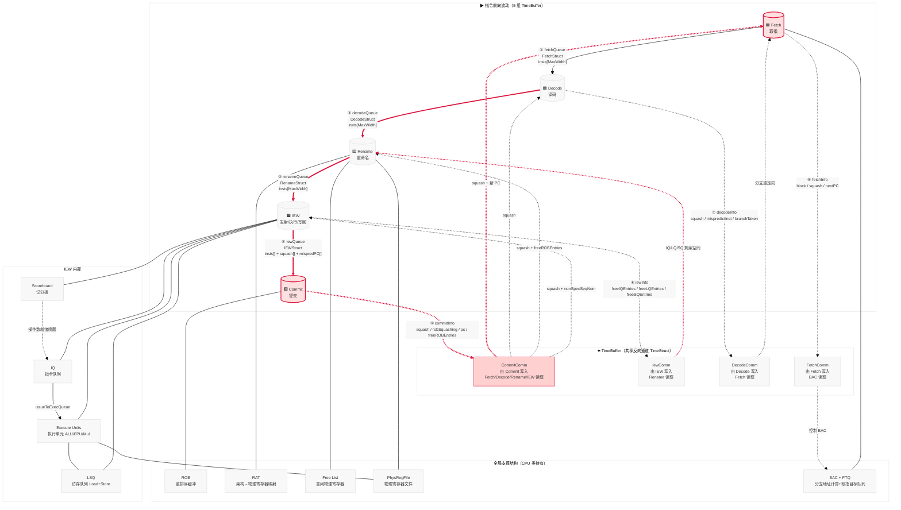

# gem5 O3CPU 流水线架构图

> 对应源码：`src/cpu/o3/` | 核心通信定义：`src/cpu/o3/comm.hh`

---

## 总体架构



---

## 图例与线型说明

| 线型 | 颜色 | 含义 |
|------|------|------|
| `→` 实线箭头 | 黑色 | 指令前向流动（5 组独立 TimeBuffer） |
| `→` 粗实线 | 红色 | **Squash 关键路径** — 分支预测失败/异常时的冲刷信号 |
| `-→` 虚线 | 灰色 | 反向控制信号（stall、资源计数、ROB 空间通知） |
| `---` | 灰色 | 全局结构与阶段的绑定关系 |

---

## 前向 5 组 TimeBuffer 详解

| 序号 | TimeBuffer 名称 | 生产者 | 消费者 | 承载结构 | 内容 |
|------|----------------|--------|--------|----------|------|
| ① | `fetchQueue` | Fetch | Decode (Commit 也会读) | `FetchStruct` | `insts[MaxWidth]` + fetch 故障 |
| ② | `decodeQueue` | Decode | Rename | `DecodeStruct` | `insts[MaxWidth]` |
| ③ | `renameQueue` | Rename | IEW (Commit 也会读) | `RenameStruct` | `insts[MaxWidth]`（已完成寄存器重命名的指令） |
| ④ | `iewQueue` | IEW | Commit | `IEWStruct` | `insts[MaxWidth]` + `squash[]` + `mispredictInst[]` + `mispredPC[]` |
| — | `issueToExecQueue` | IQ | Execute | `IssueStruct` | IEW 内部，IQ → 执行单元的就绪指令 |

---

## Squash 信号完整路径

### 触发源

1. **分支误预测** — Execute 阶段结算发现方向/目标错误
2. **Load/Store 冲突检测** — LSQ 发现内存顺序违规
3. **异常/中断** — Commit 或 IEW 检测到异常

### 信号传播链路

```
Execute 检测到分支预测错误
    │
    ▼
IEW 封装
    IEWStruct.squash[tid] = true
    IEWStruct.mispredPC[tid] = 正确目标
    IEWStruct.mispredictInst[tid] = 误预测指令
    │  iewQueue (前向 ④)
    ▼
Commit 接收后执行：
    commitInfo.squash = true
    commitInfo.robSquashing = true
    commitInfo.pc = 正确目标地址
    commitInfo.mispredictInst = 误预测指令
    │  TimeBuffer (反向 ⑤)
    │
    ├──► IEW:   清空 IQ 中推测执行的指令，LSQ 回滚
    ├──► Rename: RAT 恢复到检查点状态（架构寄存器映射恢复）
    ├──► Decode: 清空解码管线
    └──► Fetch:  从 commitInfo.pc 开始重新取指
```

### 各阶段对 Squash 的响应

| 阶段 | 收到 squash 后的动作 |
|------|---------------------|
| **Fetch** | 切换 PC 到提交层指定的目标地址，从 BTB 重新开始取指 |
| **Decode** | 清空当前所有已解码、等待传递的指令 |
| **Rename** | 恢复重命名映射表 (RAT) 到 Commit 设置的检查点；归还物理寄存器到 Free List |
| **IEW** | 清空 IQ 中 seqNum > squashedSeqNum 的指令；LSQ 丢弃推测执行的 Load/Store |
| **Commit** | (作为发起者) 从 ROB 中删除误预测指令之后的所有指令 |

---

## 各模块一句话职责

| 模块 | 一句话职责 |
|------|-----------|
| **Fetch** | 根据 PC 从 I-Cache 取指，通过 BTC/BTB 预测下一个取指地址 |
| **Decode** | 解码指令，读取架构寄存器值，拆分为微操作，检测分支并通知 Fetch |
| **Rename** | 将架构寄存器映射到物理寄存器，分配 ROB 槽位，消除 WAW/WAR 假依赖 — **顺序到乱序的质变点** |
| **IEW** | 托管 IQ（指令等待操作数就绪）、Scoreboard（就绪状态跟踪）、Execute Units（乱序执行物理计算）、LSQ（Load/Store 访存） |
| **Commit** | 按序提交指令结果到架构状态，发生异常/误预测时广播 Squash 信号 — **让乱序对外表现为顺序** |
| **ROB** | 维护指令程序顺序列表，为 Commit 提供"谁能提交"的判断，为 Rename 提供空闲槽位计数 |
| **RAT** | 记录每个架构寄存器当前映射到哪个物理寄存器，支撑 Rename 快速查表和恢复 |
| **LSQ** | 让 Load 和 Store 在乱序环境下安全执行：Store→Load 转发、地址冲突检测、违规回滚 |

---

## 源码关键文件索引

| 文件 | 内容 |
|------|------|
| `src/cpu/o3/comm.hh` | 所有 TimeBuffer 结构定义：`FetchStruct`, `DecodeStruct`, `RenameStruct`, `IEWStruct`, `IssueStruct`, `TimeStruct` |
| `src/cpu/o3/cpu.hh` | O3 顶层类，声明所有阶段和全局结构的实例 |
| `src/cpu/o3/cpu.cc` | O3 初始化：为每个阶段 set 队列和 TimeBuffer |
| `src/cpu/o3/fetch.hh` | Fetch 阶段的类声明和 TimeBuffer 读写接口 |
| `src/cpu/o3/decode.hh` | Decode 阶段 |
| `src/cpu/o3/rename.hh` | Rename 阶段 |
| `src/cpu/o3/iew.hh` | IEW 阶段（内含 `InstructionQueue` 和 `LSQ`） |
| `src/cpu/o3/commit.hh` | Commit 阶段 |
| `src/cpu/o3/rob.hh` | ROB 数据结构 |
| `src/cpu/o3/rename_map.hh` | RAT 数据结构 |
| `src/cpu/o3/free_list.hh` | 空闲物理寄存器列表 |
| `src/cpu/o3/inst_queue.hh` | 指令队列（IQ） |
| `src/cpu/o3/lsq.hh` | Load/Store 队列 |
| `src/cpu/o3/scoreboard.hh` | 记分板 |
| `src/cpu/o3/fu_pool.hh` | 功能单元池 |
